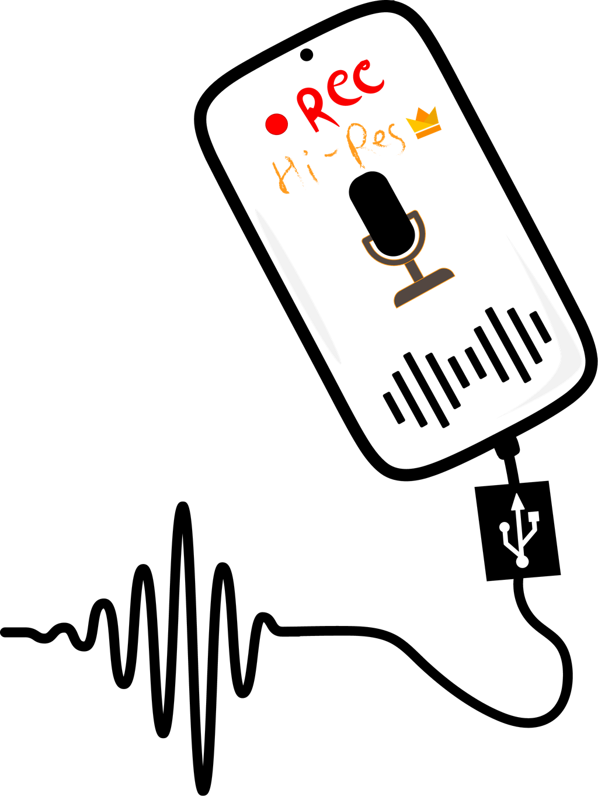

# AUDIO-rec

<p align="center">
  
</p>

**USB Audio Recording & Production Workstation** — an offline, installable Android
app for musicians, podcasters and audio engineers. Plug in a USB audio interface,
set the level, hit record. Nothing is uploaded, nothing needs an account, and the
app has no network permission at all.

*by Mostakim Billah · MIT licensed · v1.0.0 · Android 10 (API 29) and newer*

---

## Install

The signed, ready-to-install APK is in [`release/AUDIO-rec.apk`](release/AUDIO-rec.apk).

1. Copy the APK to the phone/tablet.
2. Open it and allow "install unknown apps" for the file manager or browser you
   opened it from.
3. Install, then plug in the USB interface (a USB-C OTG adapter is needed on
   phones with a USB-C port) and grant the microphone permission when asked.

Minimum Android 10. No root. The device needs USB host support, which the app
declares as a requirement, so the store/installer only offers it to hardware that
can actually run it.

## What it does

**Capture**
- Records from USB audio class interfaces (UAC1 and UAC2) through Android's USB
  audio path, with an optional direct claim of the interface for lower latency.
- Mono, stereo, or the interface's full multichannel stream.
- 16-bit integer, 24-bit integer and 32-bit float; sample rates from 44.1 kHz up
  to whatever the interface advertises (up to 384 kHz).
- Buffer sizes from 1024 to 16384 frames.
- WAV, FLAC, AIFF and OGG/Opus. **No MP3** — it is patent-encumbered; OGG/Opus is
  smaller at the same quality and free.
- Live record and playback meters with peak hold; tap a meter to clear the peaks.
- Monitor button for setting the level before you commit to a take.
- Crash-safe: an unplugged interface mid-take stops the capture and keeps the file.

**Files and library**
- Every take gets a database row: format, rate, depth, channels, duration, size,
  peak level, device, session and take number.
- Rename, star, move between sessions, delete, and export into another
  container/depth/rate without touching the original.
- Load `wav`/`aiff`/`flac`/`ogg` from anywhere on the device for playback.
- Share a take or an export with anything that accepts a `content://` stream —
  Drive, WhatsApp, a NAS client — through the app's locked-down file provider.
- Disk space display with a recordable-time estimate for the format you selected,
  and a recording folder you can point at internal storage, the app's own folder,
  or a mounted SD card.

**Workstations**
- **Dashboard** — interface, format, free space, recent takes, 14-day activity.
- **Recorder** — transport, meters, waveform/spectrum scope, capture format,
  destination, preset picker, post-take actions.
- **Mixer** — per-channel digital trims (−24…+24 dB), master gain, mute, monitor
  level, and an honest note about which controls live on the interface itself.
- **Devices** — USB descriptor facts per unit: class/subclass, interface and
  endpoint counts, asynchronous feedback detection, vendor control interfaces,
  permission state, and input/output endpoint selection.
- **Sessions · Library · Playlist · Export Files · Device Presets** — full
  create/read/update/delete over each kind of record, stored in SQLite.
- **Storage** — volumes, free space, library health (missing files, orphan files,
  empty files), folder picker, All-files-access status.
- **Settings** — capture defaults, level and monitoring defaults, device choice,
  dither, keep-screen-on, split mono inputs, peak warning, reset.
- **About** — version, author, device support list, descriptor report, licence.

Sidebar navigation on tablets and a drawer on phones; dark console palette built
around a cyan/orange meter pair.

## Build it yourself

There is no Gradle here on purpose — the whole toolchain is scripted and pinned,
so the build runs on a machine with nothing but a JRE and Python 3.

```bash
./tools/fetch-toolchain.sh     # one-time: JRE, aapt2, android.jar, d8, apksigner, keystore
./tools/build.sh               # -> release/AUDIO-rec.apk
./tools/build.sh --debug       # debug keystore instead
./tools/build.sh --no-verify   # skip the apksigner check
```

The pipeline is:

| step | tool | output |
|------|------|--------|
| resources | `aapt2 compile` / `aapt2 link` | `build/base.apk` + generated `R.java` |
| Java | ECJ 3.45 (`-source 8 -target 8`, `android.jar` boot classpath) | `build/classes` |
| dex | d8 (R8 8.2.2) | `build/dex/classes.dex` |
| package | `tools/ziptool.py` (4 K page alignment, `resources.arsc` stored) | `build/AUDIO-rec-unsigned.apk` |
| sign | `apksigner` (v1 + v2 + v3) | `release/AUDIO-rec.apk` |

`android.jar` has no `java.lang.invoke`, which the compiler needs for lambdas;
`tools/build.sh` lifts those classes out of the running runtime image once
(`tools/JdkBaseExtract.java`) and appends the directory to the boot classpath.

### Source layout

```
app/src/main/java/com/mostakim/audiorec/
  App.java                 application object: db, prefs, engine
  audio/                   capture, encoders, playback, format probing
    Pcm, AudioDevice, UsbAudioProbe, AudioEngine, Recorder
    WavWriter, AiffWriter, FlacWriter, OggWriter, OggOpusWriter
    FormatProbe, RawPcmReader, PlaybackEngine, ExportTask, Exporter
  db/                      SQLite schema, models and store
  service/                 foreground capture service, USB broadcast receiver
  share/                   content:// provider used for sharing
  ui/                      activity, sidebar/drawer shell, dialogs, screens
    kit/                   theme and view factory
    widgets/               meters, scope, faders, knobs, spectrum, disk bar
  util/                    preferences, formatting, seeding
app/src/main/res/          palette, styles, 49 vector icons, launcher art
assets/branding/           the official logo, lockup, icon preview
tools/                     build scripts, icon generator, FLAC verifier
```

## Branding

The launcher icon and every branded surface come from the author's own artwork,
`assets/branding/audiorec-logo-user.svg` (the REC / Hi-Res phone with the USB
plug and the waveform), which is kept verbatim as the source of truth.

| asset | what it is |
|-------|------------|
| `audiorec-logo-user.svg` | the supplied artwork, untouched |
| `audiorec-logo-user-flat.svg` | the same drawing with its CSS baked in as attributes, so plain rasterisers can read it |
| `audiorec-lockup-user.svg` | logo + wordmark, for docs and store listings |
| `audiorec-lockup-user.png` | the same lockup as a raster, so it renders even where no fonts are installed |
| `audiorec-mark-user.png` | transparent raster, used in this README |
| `audiorec-brand-preview.png` | the icon under square, circle and squircle masks |

The artwork is black line art with warm ink (red *REC*, amber *Hi-Res*), so it
needs a light ground: the launcher plate is warm paper (`launcher_background`)
while the app UI stays dark, and the About screen sets the logo on a paper plate
of its own. The small in-app marks that the UI tints (sidebar, dashboard) stay
monochrome vectors - a tinted illustration would be a silhouette.

Icons are committed, so a normal build needs nothing extra. To regenerate them:

```bash
python3 -m pip install --break-system-packages resvg-py   # Rust resvg bindings
python3 tools/svg_flatten.py assets/branding/audiorec-logo-user.svg \
                             assets/branding/audiorec-logo-user-flat.svg
python3 tools/gen_brand.py     # mipmaps, adaptive foreground, lockup, preview
python3 tools/gen_logo.py      # in-app marks only (it no longer owns launcher art)
```

## Formats, verified

The FLAC encoder is checked by an independent Python decoder
(`tools/flac_check.py`) that re-reads the bitstream, reverses the subframe
prediction and compares the PCM against the source WAV — every configuration
below round-trips to an identical MD5:

| rate | channels | depth | size vs WAV |
|------|----------|-------|-------------|
| 44.1 kHz | 1 | 16 | 32.9 % |
| 48 kHz | 2 | 16 | 35.0 % |
| 48 kHz | 2 | 24 | 43.9 % |
| 96 kHz | 2 | 24 | 34.4 % |
| 192 kHz | 2 | 24 | 30.4 % |
| 384 kHz | 2 | 16 | 25.5 % |
| 48 kHz | 4 / 8 | 24 | 41.7 % / 40.6 % |

WAV is written as plain RIFF, and as RF64 automatically once a take would exceed
4 GB, so long multichannel sessions at high rates stay valid. AIFF writes a
canonical 18-byte `COMM` chunk with the 80-bit IEEE sample rate. OGG uses Opus at
48 kHz (the encoder's native rate) with a 312-sample pre-skip and Vorbis-comment
tags. When the interface runs at another rate, that 48 kHz conversion carries the
fractional sample position across capture blocks, so the length and the timing of
an OGG take do not depend on the driver's buffer size.

Playback reads back everything above, plus the corners the platform extractors
mangle or refuse: 8-bit unsigned WAV and signed 8-bit AIFF, plain 32-bit ints,
IEEE float, 20-in-24 bit EXTENSIBLE, RF64 whose sizes live in `ds64` while the
data chunk still says `-1`, AIFF-C `sowt`/`fl32`, odd-sized chunks and pad bytes.
μ-law, a-law, ADPCM and 64-bit float are handed to the platform decoders instead
of being played as noise.

### Running the checks

None of the following needs a phone, an emulator or Android Studio:

```bash
bash tools/build.sh --release      # APK into release/, signature verified
bash tools/test/run.sh             # every check below; artifacts in build/fmt
```

* `tools/test/FormatSelfTest.java` writes every container at every rate/depth and
  checks the framing, the counters and the decoders (133 checks)
* `tools/test/gen_foreign.py` builds a corpus with `struct` — odd-sized chunks,
  pad bytes, 8-bit unsigned, 32-bit int, IEEE float, 20-in-24 bit EXTENSIBLE,
  RF64 with a tail chunk, AIFF-C `sowt`/`fl32`, unsupported codecs, truncated and
  garbage files — which `ReaderCheck.java` reads back (108 checks); nothing in it
  was produced by our own writers
* `tools/test/ResamplerCheck.java` feeds the 48 kHz resampler irregular block
  sizes and compares it with a single-pass reference at twelve rates, with a
  negative control that fails if the old per-block carry logic ever comes back
  (54 checks)
* `tools/format_check.py` scores the artifacts byte by byte without using any of
  the app's code

## Hardware notes

Built and tuned against: Jcally JM6 Pro 2, M-Audio Duo / Fast Track / Fast Track
Pro, PreSonus AudioBox 22VSL / 44VSL, Blue Snowball / Yeti / Yeti Pro, RME
Babyface, Zoom H2 / H2n / H4, and generic UAC1/UAC2 HiFi DACs.

Things the app deliberately does **not** pretend to do:

- Hardware gain, pad, phantom power and direct-monitor knobs live on the
  interface; USB audio class has no standard control for them. The mixer's trims
  are digital and are applied before the meters and the file, so what you see is
  what gets written.
- Multichannel playback is not exposed: monitoring and playback use the first two
  outputs of the selected device, as specified.
- Vendor control panels (Focusrite, PreSonus, TotalMix) are left alone; the app
  can claim a vendor interface so it does not sit in the way, but it does not
  write vendor registers.

## Privacy

No network permission is declared, so the app cannot talk to anything even in
principle: no accounts, no analytics, no cloud, no login. Recordings stay in the
folder you choose until you share or move them.

## Licence

MIT © 2026 Mostakim Billah. See [LICENSE](LICENSE).
